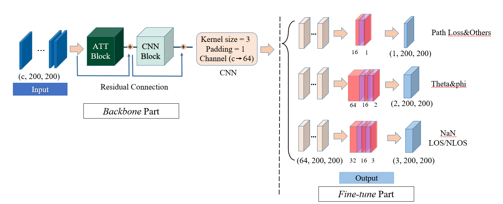
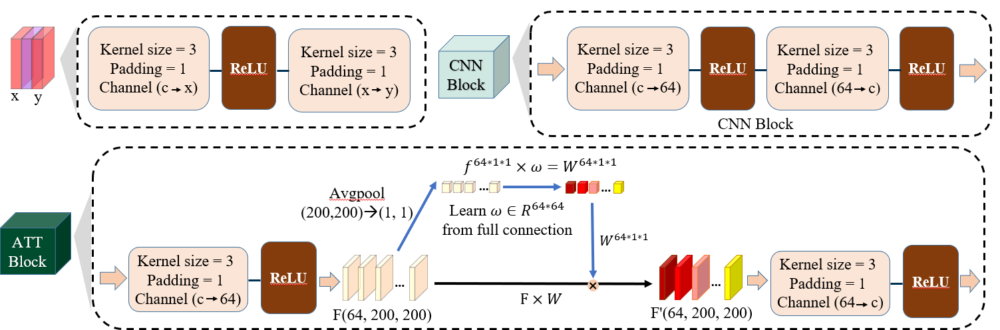

# A Multi-Task Learning Model for Super Resolution of Wireless Channel Characteristics






[](https://github.com/lingMori/A-Multi-Task-Learning-Model-for-Super-Resolution-of-Wireless-Channel-Characteristics)


We propose a novel super resolution (SR) model for generating channel characteristics data. The model 

is based on multi-task learning (MTL) convolutional neural networks (CNN) with residual connection. 

Experiments demonstrate that the proposed SR model could achieve excellent performances in mean 

absolute error and standard deviation of error.

## Table of Contents

- [Background](#background)
- [Install](#install)
- [Usage](#usage)
- [Dataset](#api)
- [Contributing](#contributing)
- [License](#license)

## Background

### present

Channel modeling has always been the core part in communication system design and development, especially in 5G and 6G era. Traditional approaches like stochastic channel modeling and ray-tracing (RT) based channel modeling depend heavily on measurement data or simulation, which are usually expensive and time consuming. 

> For SCM, channel characteristics like path loss (PL), propagation condition (line of sight or non line of sight), delay spread, angular spreads and Rician K-factor are required to generate channel coefficients and thereafter to model the wireless channel. Massive channel measurements in different environments, which are usually time-consuming and expensive, must be conducted to obtain the necessary channel characteristics data. 

> On the other side, RT based modeling approach can generate accurate channel data if given precise propagation environment and configuration, but at the cost of high computational complexity and enormous calculation time. Therefore, a fast and reliable channel characteristics data generation method will effectively address these limitations.

### our contribution

Instead of prediction or estimation, we propose a super resolution (SR) model for channel characteristics. The model is based on MTL CNN with residual connection. Overview of our work is shown in Figs. Given 3D models of urban areas and the corresponding EM parameters, CloudRT platform outputs channel characteristics dataset and the dataset is used for SR model training. Data from the dataset are degraded into low resolution data as input. Original high resolution data are used as the ground truth. MTL loss is employed to better balance multi tasks. We evaluate our proposed SR model by ablation study and comparisons with other DL models. 

Specifically, we make the **following contributions**:

1. In dense urban areas, **RT simulation by self developed CloudRT** was conducted and channel characteristics dataset are constructed based on simulation results.

2. A residual network based **MTL SR model** is proposed. Weighted masks are added in loss function. Homoscedastic uncertainty is employed to balance the single task losses during training. Residual connection and iterative up-and-down technique are implemented in CNN blocks for better SR performances.

3. Training process and results of evaluation are provided. The proposed SR approach generally performs better than other state-of-the-art DL models. **Comparing with baseline**, the proposed approach could achieve very good SR results in all channel characteristics targets and deteriorate significantly less than baseline with larger scale factor. All the results are in the `result` folder.

   

## Install

This project uses [Anaconda](https://www.anaconda.com/) and [PyTorch](https://pytorch.org/)  . Go check them out if you don't have them locally installed.

```
pip3 install torch torchvision torchaudio --extra-index-url https://download.pytorch.org/whl/cu113
```

All the model and demo are based on the PyTorch(1.12.1) and CUDA(11.3/10.2). Please check whether your build version is correct before run this project. **Both Windows and Linux can make through**.


## Usage

Users can download the code above, we specially recommend to download zip to develop the project.

You can run the project with the following command statement.

```
python mlt_main.py
```


## Dataset

Workers can use [CloudRT](http://cn.raytracer.cloud:9090/) to build your own Channel Characteristics dataset and package them into a `.mat` file, then put them into the `data` folder. So can we train our own datasets.

**Note**: If you would like to obtain **a** **well-built dataset**, please contact us by email. Our contact email is `wangxiping@bjtu.edu.cn`


## Contributing

Feel free to dive in! Open an issue or submit PRs.

**Small note**: If editing the Readme, please conform to the [standard-readme](https://github.com/RichardLitt/standard-readme) specification.

### Contributors

This project exists thanks to all the people who contribute.


## License

no license now.
